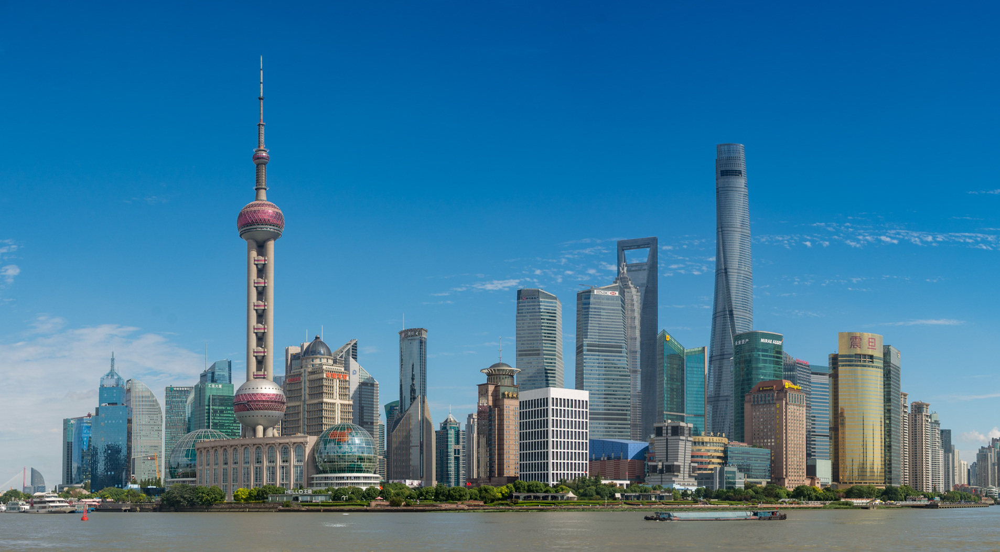

# Cidades

## Aveiro

**População**: ~63k habitantes

**Factos**:
- Veneza de Portugal
    - Canais no interior da cidade
- Cidade Portuária
    - Porto de Aveiro
- Localização
    - Beira Mar
- Área Total
    - 197,58 km²

**Links**:
	[Aveiro City](https://www.visitportugal.com/pt-pt/content/visita-a-aveiro)

**Imagem**:

----------------------------------------------------------------------------------

## Shanghai

**População**: ~27M habitantes

**Factos**:
- Maior Cidade da China
    - Uma das mais populosas do mundo
- Cidade Portuária
    - Porto de Shanghai
- Localização
    - Beira Mar
- Área Total
    - 6 340,5 km²

**Links**:
	[Shanghai City](https://www.meet-in-shanghai.net/en/)

**Imagem**:

----------------------------------------------------------------------------------

## Rio de Janeiro

**População**: ~6M habitantes

**Factos**:
- Segunda Maior Cidade do Brazil
    - "Cidade Maravilhosa"
- Cidade Portuária
    - Porto do Rio de Janeiro
- Localização
    - Beira Mar
- Área Total
    - 1 200,329 km²

**Links**:
	[Rio de Janeiro City](https://www.riodejaneiro.com/)

**Imagem**:
